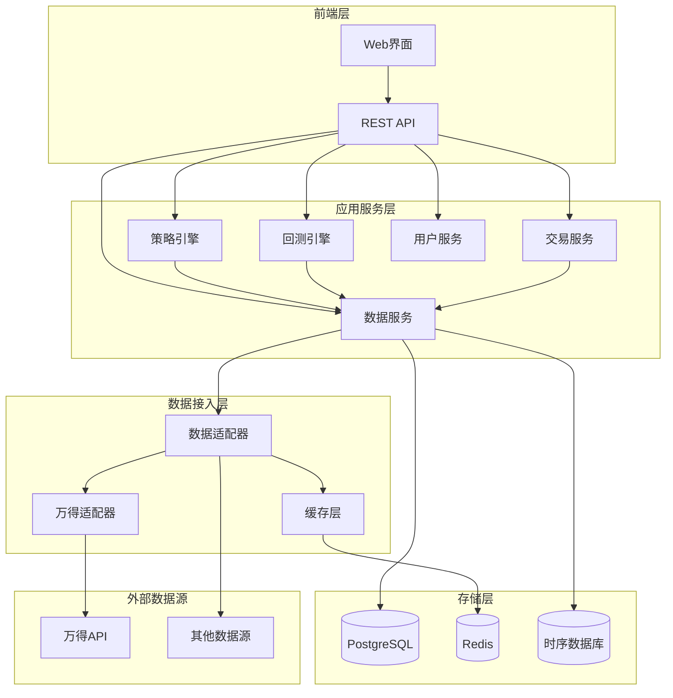

# 设计文档

## 概述

量化投资研究框架采用微服务架构设计，支持多数据源接入、策略回测、实时交易建议等功能。系统设计遵循SOLID原则，采用插件化架构确保良好的扩展性和可维护性。

## 架构设计

### 整体架构



### 核心设计原则

1. **模块化设计**：每个功能模块独立开发和部署
2. **接口抽象**：通过接口定义模块间的交互契约
3. **插件化架构**：数据源和策略算法支持插件式扩展
4. **配置驱动**：系统行为通过配置文件控制
5. **异步处理**：耗时操作采用异步模式提升性能

## 组件和接口

### 1. 数据服务层 (DataService)

#### 核心接口设计

```python
# 数据源抽象接口
class IDataSource:
    def get_price_data(self, symbols: List[str], start_date: str, end_date: str) -> DataFrame
    def get_fundamental_data(self, symbols: List[str], fields: List[str]) -> DataFrame
    def get_realtime_data(self, symbols: List[str]) -> DataFrame
    def health_check(self) -> bool

# 聚宽兼容接口
class JQCompatibleAPI:
    def get_price(self, security, start_date=None, end_date=None, frequency='daily', fields=None)
    def get_fundamentals(self, query, date=None)
    def get_current_data(self, security=None)
    def attribute_history(self, security, count, unit='1d', fields=['price'], skip_paused=False)
```

#### 万得数据适配器

```python
class WindDataAdapter(IDataSource):
    def __init__(self, config: WindConfig):
        self.w = WindAPI(config)
        self.rate_limiter = RateLimiter(max_calls=100, time_window=60)
        self.cache = CacheManager()
    
    def get_price_data(self, symbols: List[str], start_date: str, end_date: str) -> DataFrame:
        # 实现万得价格数据获取逻辑
        # 包含重试机制、限流控制、缓存策略
        pass
```

### 2. 策略引擎 (StrategyEngine)

#### 策略执行框架

```python
class StrategyEngine:
    def __init__(self, data_service: IDataService):
        self.data_service = data_service
        self.scheduler = StrategyScheduler()
        self.context_manager = ContextManager()
    
    def run_strategy(self, strategy_code: str, config: StrategyConfig) -> StrategyResult:
        # 策略执行逻辑
        # 支持聚宽兼容的API调用
        pass
    
    def validate_strategy(self, strategy_code: str) -> ValidationResult:
        # 策略代码验证
        pass
```

#### 聚宽兼容层

```python
class JQCompatibleContext:
    """聚宽平台兼容的上下文对象"""
    def __init__(self, portfolio_value: float, positions: Dict):
        self.portfolio = Portfolio(portfolio_value)
        self.current_dt = None
        self.previous_date = None
        
    def order_shares(self, security, amount):
        # 兼容聚宽的下单接口
        pass
    
    def order_percent(self, security, percent):
        # 按比例下单
        pass
```

### 3. 回测引擎 (BacktestEngine)

#### 回测核心组件

```python
class BacktestEngine:
    def __init__(self, data_service: IDataService):
        self.data_service = data_service
        self.trade_calendar = TradeCalendar()
        self.commission_model = CommissionModel()
        self.slippage_model = SlippageModel()
    
    def run_backtest(self, strategy: Strategy, config: BacktestConfig) -> BacktestResult:
        # 回测执行逻辑
        pass
    
    def generate_report(self, result: BacktestResult) -> BacktestReport:
        # 生成详细的回测报告
        pass
```

#### 交易规则引擎

```python
class TradingRulesEngine:
    """处理各交易所的交易规则"""
    def __init__(self):
        self.rules = self._load_trading_rules()
    
    def validate_order(self, security: str, amount: int, price: float) -> ValidationResult:
        # 验证订单是否符合交易规则
        # 检查最小交易单位、最低金额等
        pass
    
    def adjust_order(self, security: str, amount: int) -> int:
        # 根据交易规则调整订单数量
        pass
```

### 4. 交易服务 (TradingService)

#### 实时交易支持

```python
class TradingService:
    def __init__(self, data_service: IDataService):
        self.data_service = data_service
        self.signal_generator = SignalGenerator()
        self.notification_service = NotificationService()
    
    def generate_trading_signals(self, strategy: Strategy) -> List[TradingSignal]:
        # 生成交易信号
        pass
    
    def send_signal_to_trader(self, signal: TradingSignal, trader_id: str):
        # 向交易员发送交易建议
        pass
    
    def record_actual_trade(self, trade: ActualTrade):
        # 记录实际成交信息
        pass
```

## 数据模型

### 核心数据结构

```python
@dataclass
class SecurityInfo:
    symbol: str
    name: str
    exchange: str
    sector: str
    industry: str

@dataclass
class PriceData:
    symbol: str
    datetime: datetime
    open: float
    high: float
    low: float
    close: float
    volume: int
    amount: float

@dataclass
class Position:
    security: str
    shares: int
    avg_cost: float
    current_price: float
    market_value: float
    pnl: float

@dataclass
class TradingSignal:
    strategy_id: str
    security: str
    action: str  # 'buy', 'sell', 'hold'
    quantity: int
    price: float
    reason: str
    confidence: float
    timestamp: datetime

@dataclass
class BacktestResult:
    strategy_id: str
    start_date: date
    end_date: date
    initial_capital: float
    final_value: float
    total_return: float
    annual_return: float
    max_drawdown: float
    sharpe_ratio: float
    win_rate: float
    total_trades: int
    profitable_trades: int
    trade_details: List[TradeRecord]
    position_details: List[PositionRecord]
    profit_details: List[ProfitRecord]
```

### 数据库设计

```sql
-- 策略表
CREATE TABLE strategies (
    id SERIAL PRIMARY KEY,
    name VARCHAR(255) NOT NULL,
    code TEXT NOT NULL,
    author_id INTEGER,
    created_at TIMESTAMP DEFAULT CURRENT_TIMESTAMP,
    updated_at TIMESTAMP DEFAULT CURRENT_TIMESTAMP
);

-- 回测结果表
CREATE TABLE backtest_results (
    id SERIAL PRIMARY KEY,
    strategy_id INTEGER REFERENCES strategies(id),
    config JSONB,
    metrics JSONB,
    created_at TIMESTAMP DEFAULT CURRENT_TIMESTAMP
);

-- 交易记录表
CREATE TABLE trade_records (
    id SERIAL PRIMARY KEY,
    backtest_id INTEGER REFERENCES backtest_results(id),
    datetime TIMESTAMP,
    security VARCHAR(20),
    action VARCHAR(10),
    quantity INTEGER,
    price DECIMAL(10,4),
    commission DECIMAL(10,4),
    slippage DECIMAL(10,4)
);
```

## 错误处理

### 分层错误处理策略

1. **数据层错误**：
   - 网络连接异常：自动重试机制（指数退避）
   - 数据源限流：请求队列和限流控制
   - 数据质量问题：数据验证和清洗

2. **业务层错误**：
   - 策略执行异常：异常捕获和日志记录
   - 交易规则违反：订单验证和调整
   - 计算错误：结果验证和边界检查

3. **系统层错误**：
   - 内存不足：资源监控和清理
   - 服务不可用：健康检查和降级处理

### 错误处理实现

```python
class ErrorHandler:
    def __init__(self):
        self.logger = logging.getLogger(__name__)
        self.retry_config = RetryConfig()
    
    @retry(max_attempts=3, backoff_factor=2)
    def handle_data_request(self, func, *args, **kwargs):
        try:
            return func(*args, **kwargs)
        except NetworkError as e:
            self.logger.warning(f"Network error: {e}, retrying...")
            raise
        except RateLimitError as e:
            self.logger.info(f"Rate limit hit: {e}, waiting...")
            time.sleep(e.retry_after)
            raise
```

## 测试策略

### 测试金字塔

1. **单元测试**（70%）：
   - 数据适配器测试
   - 策略引擎核心逻辑测试
   - 回测计算准确性测试

2. **集成测试**（20%）：
   - 数据服务集成测试
   - 策略执行端到端测试
   - API接口测试

3. **系统测试**（10%）：
   - 性能测试
   - 压力测试
   - 兼容性测试

### 测试实现示例

```python
class TestWindDataAdapter(unittest.TestCase):
    def setUp(self):
        self.adapter = WindDataAdapter(test_config)
        self.mock_wind_api = Mock()
    
    def test_get_price_data_success(self):
        # 测试正常数据获取
        pass
    
    def test_get_price_data_with_retry(self):
        # 测试重试机制
        pass
    
    def test_rate_limiting(self):
        # 测试限流功能
        pass

class TestJQCompatibility(unittest.TestCase):
    def test_get_price_compatibility(self):
        # 测试聚宽API兼容性
        pass
    
    def test_strategy_execution_compatibility(self):
        # 测试策略执行兼容性
        pass
```

## 性能优化

### 缓存策略

1. **多级缓存**：
   - L1缓存：内存缓存（Redis）
   - L2缓存：本地文件缓存
   - L3缓存：数据库缓存

2. **缓存策略**：
   - 价格数据：按时间分片缓存
   - 基本面数据：按更新频率缓存
   - 计算结果：按策略和参数缓存

### 异步处理

```python
class AsyncDataService:
    def __init__(self):
        self.executor = ThreadPoolExecutor(max_workers=10)
        self.cache = AsyncCache()
    
    async def get_multiple_securities_data(self, symbols: List[str]) -> Dict[str, DataFrame]:
        tasks = [self.get_security_data(symbol) for symbol in symbols]
        results = await asyncio.gather(*tasks)
        return dict(zip(symbols, results))
```

## 部署架构

### 容器化部署

```dockerfile
# Dockerfile示例
FROM python:3.9-slim

WORKDIR /app
COPY requirements.txt .
RUN pip install -r requirements.txt

COPY . .
EXPOSE 8000

CMD ["uvicorn", "main:app", "--host", "0.0.0.0", "--port", "8000"]
```

### Kubernetes部署

```yaml
# deployment.yaml
apiVersion: apps/v1
kind: Deployment
metadata:
  name: quant-framework
spec:
  replicas: 3
  selector:
    matchLabels:
      app: quant-framework
  template:
    metadata:
      labels:
        app: quant-framework
    spec:
      containers:
      - name: api-server
        image: quant-framework:latest
        ports:
        - containerPort: 8000
        env:
        - name: DATABASE_URL
          valueFrom:
            secretKeyRef:
              name: db-secret
              key: url
```

### 配置管理

```python
class Config:
    # 数据源配置
    WIND_CONFIG = {
        'username': os.getenv('WIND_USERNAME'),
        'password': os.getenv('WIND_PASSWORD'),
        'server': os.getenv('WIND_SERVER', 'default'),
        'timeout': int(os.getenv('WIND_TIMEOUT', '30'))
    }
    
    # 数据库配置
    DATABASE_URL = os.getenv('DATABASE_URL')
    REDIS_URL = os.getenv('REDIS_URL')
    
    # 回测配置
    DEFAULT_COMMISSION = float(os.getenv('DEFAULT_COMMISSION', '0.0003'))
    DEFAULT_SLIPPAGE = float(os.getenv('DEFAULT_SLIPPAGE', '0.001'))
```

这个设计文档提供了一个完整的、可扩展的量化投资研究框架架构，充分考虑了你提到的所有需求，包括万得数据接口集成、聚宽平台兼容性、云端部署支持等。